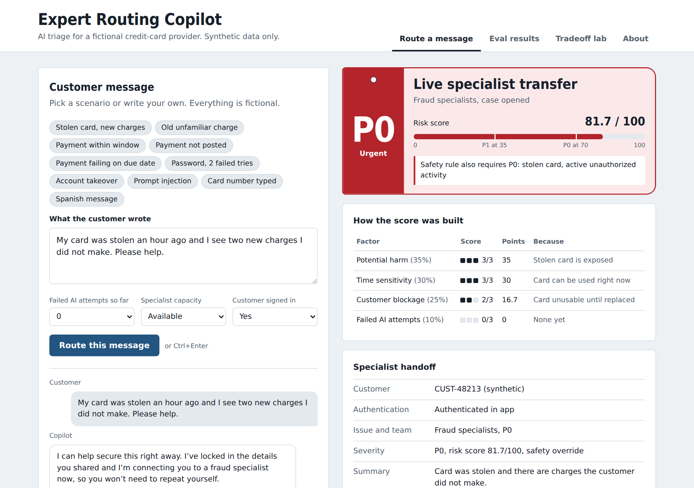
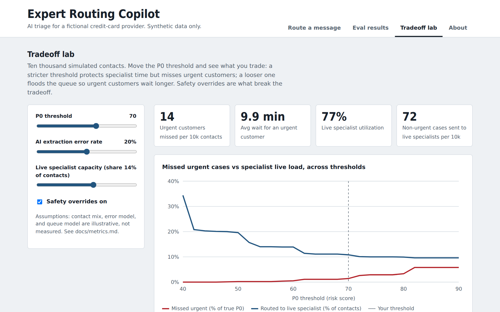

# Expert Routing Copilot

**AI triage for customer support that knows when not to automate.** Expert Routing Copilot interprets a fictional customer request, separates ownership from urgency, applies deterministic safety policy, and prepares a handoff that lets a specialist begin without restarting intake.

**[Try the simulator](https://stella-ola.github.io/expert-routing-copilot/)** · Fictional credit-card provider · Synthetic data and simulated results only



## In 30 seconds

- **Problem:** customers with fraud, billing, or product-support needs may be transferred, repeat themselves, wait in the wrong queue, or remain with automation too long.
- **What I built:** a product strategy, deterministic routing policy, interactive simulator, structured handoff, grounded answers that cite approved articles, a 102-case eval harness with cost, latency, and consistency measurement, a rules-vs-LLM comparison, tradeoff lab, CI regression gate, rollout plan, and decision record.
- **Core design decision:** the AI or rules layer **understands** the message; a deterministic, versioned policy **decides** severity and route. This keeps high-stakes decisions auditable and allows the understanding layer to improve independently.
- **Most important result:** keyword rules reach 100% exact match on the gated cases they were tuned on but only 32.9% on 70 held-out cases, catching **1 of 23 new urgent cases (4.3% P0 recall)**. The rules baseline is therefore **not launch-ready**. That failure is the evidence for testing a better extractor behind the same policy.
- **No source, no answer:** when the AI answers in chat, it quotes an approved article and names it. If no article fits, a person answers. On held-out cases this rule caught two urgent cases the classifier had misread as routine questions.

## How it decides

```text
message
  → redact sensitive numbers
  → extract structured facts
  → calculate contextual risk
  → apply safety and human overrides
  → check specialist capacity
  → select channel and prepare handoff
```

| Priority | Example | Default route |
| --- | --- | --- |
| **P0** | Stolen card with active unauthorized charges | Live specialist or priority callback |
| **P1** | Payment outside the expected posting window | Managed case or expert chat |
| **P2** | Routine rewards or product question | AI guidance, clarification, or requested human support |

The weighted score uses potential harm (35%), time sensitivity (30%), customer blockage (25%), and failed attempts (10%). Safety overrides beat the score. Human overrides change the channel without falsely inflating severity.

## Evaluation results

All cases and labels are synthetic and authored for this portfolio. They demonstrate the evaluation method; they do not establish production performance.

| Metric | Golden set: 32 cases | Held-out: 70 cases |
| --- | ---: | ---: |
| Exact match: team + priority + channel | 87.5% | 32.9% |
| Exact match excluding four declared baseline gaps | 100% | 32.9% |
| P0 recall (urgent cases caught) | 77.8% | **4.3%** |
| Reached a human when required | 95.2% | 53.2% |
| Citation accuracy (AI cited the right article) | 88.9% | 38.1% |
| AI answered a case it should have routed | 0 | 7 |

Held-out cases are tagged by risk type, so failures are visible instead of averaged away. The rules catch **0%** of implicit-fraud and multi-issue urgent cases.

The CI workflow protects the tuned baseline from regression. It does **not** certify production readiness. The held-out readiness gate stays blocked until a candidate extractor reaches 100% P0 recall, at least 80% exact match, at least 98% appropriate human reach, at least 90% citation accuracy, zero chat answers on cases that needed routing, and the same decision on at least 95% of cases across three runs with zero urgency flips.

[Read every result](data/eval-results-rules.md) · [Evaluation plan](docs/evaluation-plan.md) · [Failure analysis](docs/failure-analysis.md)

## Rules vs LLM

Same 102 cases, same deterministic policy. Only the step that reads the message changes. The table reports quality, cost per ticket, cost per **correctly routed** ticket, latency, and whether the same message gets the same decision on every run.

[Rules vs LLM comparison](data/comparison.md) · [How the AI's variability is contained](docs/product-spec.md#12-ai-behavior-that-isnt-the-same-every-time-v21)

## Tradeoff lab



The simulator models 10,000 fictional contacts and lets a reviewer vary the P0 threshold, extraction error, specialist capacity, and safety overrides. It makes the central operational tradeoff visible: lowering the threshold protects recall but can overload specialists; raising it preserves capacity but can miss urgent customers. The population, queue model, and outputs are explicitly simulated assumptions.

## Product and AI-PM artifacts

| Area | Artifact |
| --- | --- |
| Hiring-manager overview | [Portfolio case study](docs/portfolio-case-study.md) |
| Problem, users, policy, scope | [Product specification](docs/product-spec.md) |
| System and decision flow | [Architecture](docs/architecture.md) |
| Prioritization | [Prioritization](docs/prioritization.md) |
| Sequencing | [Outcome-based roadmap](docs/roadmap.md) |
| Outcome, input, guardrail, and AI metrics | [Metric hierarchy](docs/metrics.md) |
| Golden, held-out, red-team, and online evals | [Evaluation plan](docs/evaluation-plan.md) |
| Confidence and escalation | [Confidence and human handoff](docs/confidence-and-human-handoff.md) |
| Failure taxonomy and FMEA | [Failure analysis](docs/failure-analysis.md) |
| “How could this fail?” exercise | [Pre-mortem](docs/pre-mortem.md) |
| Privacy, fairness, accessibility, oversight | [Responsible AI](docs/responsible-ai.md) |
| Research assumptions and validation | [Research and validation](docs/research-validation.md) |
| Shadow, assisted, and controlled tests | [Experimentation](docs/experimentation.md) |
| Stakeholders, adoption, rollback | [Rollout, GTM, and adoption](docs/rollout-gtm.md) |
| Synthetic business-case model | [Operational economics](docs/operational-economics.md) |
| Material product tradeoffs | [Decision log](docs/decision-log.md) |
| Before-and-after learning | [Retrospective](docs/retrospective.md) |
| Two-minute walkthrough | [Demo script](docs/demo-script.md) |

## Run locally

Requires Node 20 or newer and no installed dependencies.

```bash
npm test
npm run evals
npm run serve
```

The optional LLM extractor uses the same structured feature contract and deterministic policy. It runs every case three times to measure consistency, then builds the comparison:

```bash
ANTHROPIC_API_KEY=your_key npm run evals:llm
npm run compare
```

Never place an API key in the repository. LLM output must be evaluated repeatedly on the locked held-out set before any recommendation to advance beyond shadow mode.

## Repository map

```text
.
├── README.md
├── docs/
│   ├── index.html                 # GitHub Pages simulator and tradeoff lab
│   ├── app/engine.js              # extraction, risk, policy, grounding, evals, simulation
│   ├── app/policies.js            # 12 approved help articles and the keyword retriever
│   ├── app/golden-set.js          # 32 golden and 70 held-out cases
│   └── *.md                       # product and AI-PM artifacts
├── evals/
│   ├── run-evals.mjs              # evaluation runner, gates, cost, latency, consistency
│   ├── compare.mjs                # rules vs LLM side by side
│   └── llm-extractor.mjs          # optional candidate understanding layer
├── data/                           # generated synthetic eval results and comparison
├── tests/                          # deterministic policy tests
└── archive/                        # preserved earlier prototypes and source spec
```

## Boundaries

- No real customer, account, transaction, queue, or company data is used.
- The rules confidence value is an inspectable proxy, not a calibrated probability.
- The project performs no authentication, card lock, payment, refund, dispute, or other account action.
- Targets, SLAs, cost assumptions, risk weights, and thresholds are hypotheses requiring domain, customer, operations, risk, privacy, legal, compliance, security, and accessibility review.
- The optional LLM extractor is a candidate, not a shipped component.
- Help articles are fictional. Model prices in `evals/llm-extractor.mjs` were checked against [Anthropic's Haiku 5.5 pricing](https://www.anthropic.com/claude-haiku-5-5) in October 2026 and must be rechecked before quoting cost figures.
- This project is not affiliated with any company.
