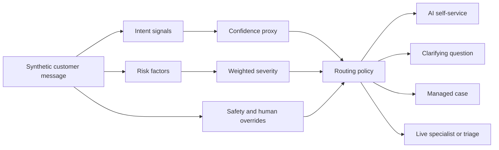

# Expert Routing Copilot

An AI product management case study and interactive simulator for routing fictional credit-card support requests to AI self-service, a managed case, or a human specialist.

> **Portfolio simulation:** This project uses only synthetic scenarios and deterministic heuristics. Confidence values and evaluation results are simulated decision-support signals, not production model probabilities or real company performance claims.

## Why this project exists

Customers can lose time when support systems misunderstand their intent, underestimate urgency, send them to the wrong queue, or keep them in automation too long. Expert Routing Copilot explores a safer routing policy across three decisions:

1. **Who owns the issue?** Fraud, billing, or product support.
2. **How urgent is it?** P0, P1, or P2 based on harm, time sensitivity, blockage, and failed attempts.
3. **Who should handle it?** AI, a clarifying step, a managed case, or a live human.

The prototype makes those decisions visible and auditable. It also demonstrates where the policy can fail.

## Try the simulator

Open [`docs/index.html`](docs/index.html) locally, or enable GitHub Pages from the repository's `/docs` folder.

The simulator lets you:

- run curated synthetic support scenarios or type a fictional message;
- inspect detected intent, confidence proxy, risk factors, safety overrides, and route rationale;
- adjust the clarify and auto-route confidence thresholds;
- run the synthetic evaluation set and inspect mismatches;
- review the structured human-handoff card.

## Product strategy at a glance

| Layer | Portfolio evidence |
| --- | --- |
| Problem and scope | [Product specification](docs/product-spec.md) |
| Prioritization | [Prioritization](docs/prioritization.md) |
| Metric hierarchy | [Metrics](docs/metrics.md) |
| AI evaluation | [Evaluation plan](docs/evaluation-plan.md) |
| Confidence policy | [Confidence and human handoff](docs/confidence-and-human-handoff.md) |
| Failure analysis | [Failure analysis](docs/failure-analysis.md) |
| Safety | [Responsible AI](docs/responsible-ai.md) |
| Experimentation | [Experimentation](docs/experimentation.md) |
| Discovery | [Research and validation](docs/research-validation.md) |
| Launch | [Rollout, GTM, and adoption](docs/rollout-gtm.md) |
| Sequencing | [Roadmap](docs/roadmap.md) |
| Product judgment | [Decision log](docs/decision-log.md) |
| Learning | [Retrospective](docs/retrospective.md) |

## How the simulated decision works



The weighted risk score is:

`harm × 35% + time sensitivity × 30% + blockage × 25% + failed attempts × 10%`

Each factor is scored from 0 to 3 and normalized to 100. Safety rules override the numeric score. The confidence proxy controls whether the system routes, asks a clarifying question, or defers to human triage.

## Evaluation approach

The checked-in synthetic dataset covers fraud, billing, product support, ambiguous requests, explicit human requests, and repeated automation failure. The evaluation reports intent, priority, and route accuracy separately, plus safety recall and automation coverage. This prevents a high overall score from hiding a harmful miss.

Run the local checks with:

```bash
npm test
```

## Repository map

```text
.
├── README.md
├── archive/original-simulator/   # preserved uploaded source
├── docs/
│   ├── index.html                # GitHub Pages simulator
│   ├── app.js, router.js, styles.css
│   ├── data/synthetic-cases.json
│   └── *.md                      # PM and AI-PM artifacts
├── tests/router.test.mjs
└── package.json
```

## Boundaries and assumptions

- All people, accounts, transactions, queues, SLAs, and outcomes are fictional.
- The classifier is a transparent heuristic stand-in, not a trained AI model.
- The project does not process real personal data or perform account actions.
- Thresholds, severity weights, queue policies, and target metrics require validation with customers, support specialists, risk, legal, compliance, and operations.
- Simulated evaluation results show how to evaluate a future system; they do not prove production readiness.

## What this demonstrates

This project is intentionally more than a UI mockup. It demonstrates problem framing, scope control, prioritization, metric design, threshold strategy, human-in-the-loop design, failure analysis, safety thinking, experimentation, rollout planning, and explicit product decisions.
