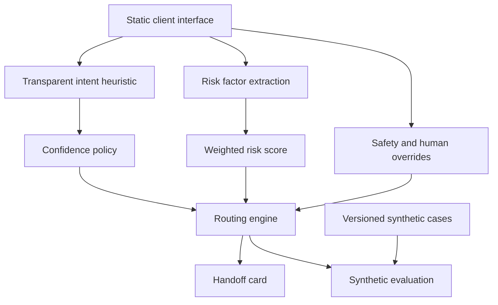
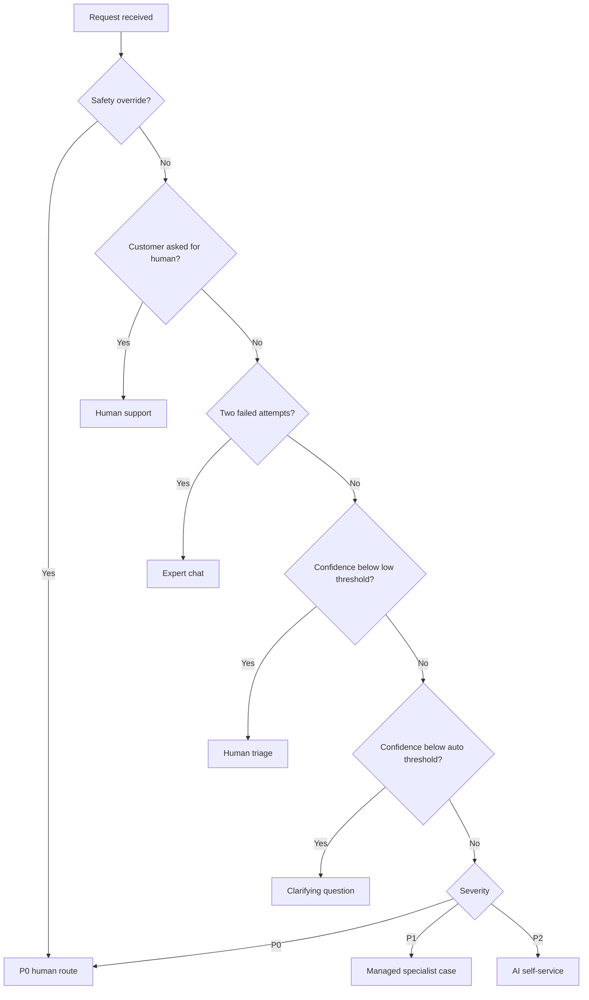

# Architecture and Decision Flow

## Prototype architecture

The entire prototype runs in the browser and sends no data to a server. The heuristic is intentionally readable so the portfolio focuses on product decisions. A production system would replace or supplement it with authenticated context, approved knowledge, monitored models, policy services, case management, and audit logging.

## Decision precedence

## Production evolution

| Prototype component | Production evolution | Required control |
| --- | --- | --- |
| Keyword heuristic | Calibrated intent and risk models plus deterministic policies | Model registry, versioning, calibration, drift monitoring |
| Browser-only factors | Authenticated account and event context | Least-privilege access and data minimization |
| Static handoff | Case-management integration | Schema validation, audit log, specialist feedback |
| Synthetic eval set | Curated, de-identified, consented evaluation data | Governance, slice analysis, refresh cadence |
| Adjustable thresholds | Policy configuration service | Approval workflow, rollback, shadow evaluation |

## Audit record for a real system

Each decision should record a request ID, timestamp, policy and model versions, predicted intent, calibrated confidence, extracted risk factors, score, override, selected route, human corrections, and final outcome. Sensitive free text should be minimized or tokenized according to an approved retention policy.

