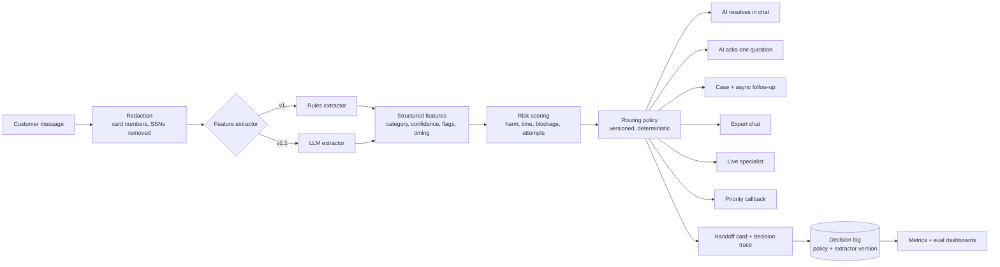
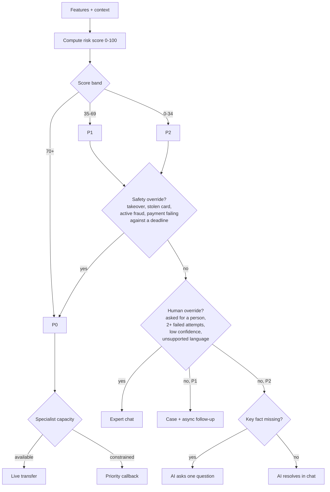

# Architecture

## System

The split between the extractor (understanding) and the policy (deciding) is the core design choice: the extractor can change (rules, an LLM, a future fine-tuned model) without changing what "urgent" means. Both extractors emit the same feature shape, which also makes the rules extractor the fallback if the LLM is slow or down.

## Routing decision

## Repository map

| Path | What it is |
| --- | --- |
| `docs/index.html` | The simulator (GitHub Pages) |
| `docs/app/engine.js` | Extraction, scoring, policy, evals, and population simulation. One module, used by the page and by Node. |
| `docs/app/golden-set.js` | Golden and held-out eval sets |
| `evals/run-evals.mjs` | Eval runner, regression gate, and held-out readiness assessment |
| `evals/llm-extractor.mjs` | Optional LLM extractor, same output shape |
| `data/` | Generated eval results |
| `archive/original-simulator/` | The original simulator prototype, kept for comparison |
| `archive/codex-v1/` | The first portfolio documentation and site iteration |
| [`retrospective.md`](retrospective.md) | What changed and what was learned |
