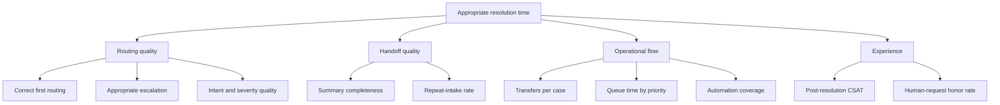

# Metric Hierarchy

## Metric strategy

No single metric can represent routing quality. A lower time to resolution is not a win if the system misses fraud, frustrates customers, or shifts work into overloaded queues. The hierarchy combines an outcome metric, leading indicators, AI quality measures, and guardrails.

## North Star

**Appropriate resolution time:** median time from first contact to a resolved outcome, reported only for cases that were handled safely and reached the correct owner.

This is preferable to raw time to resolution because fast but wrong or unsafe resolutions should not count as success. It must be segmented by intent, severity, channel, and customer cohort.

## Metric tree

## Definitions

| Metric | Definition | Type |
| --- | --- | --- |
| Correct first routing | Cases whose first assigned owner matches adjudicated owner ÷ eligible cases | Leading indicator |
| Appropriate escalation | Cases whose human/AI handling matches policy and expert judgment ÷ eligible cases | Leading indicator |
| Safety recall | Safety-critical cases routed to the required P0 human path ÷ all adjudicated safety-critical cases | Guardrail |
| High-confidence error rate | Incorrect automated decisions at or above the auto threshold ÷ high-confidence automated decisions | Guardrail |
| Automation coverage | Eligible cases completed or case-routed without live triage ÷ eligible cases | Efficiency |
| Handoff completeness | Required handoff fields accepted as usable by specialists ÷ human handoffs | Quality |
| Repeat-intake rate | Human handoffs where the customer repeats material facts ÷ human handoffs | Experience |
| Transfer rate | Cases with one or more team transfers ÷ resolved cases | Operational |
| Override compliance | Policy-triggering cases where the required override was applied ÷ triggering cases | Guardrail |
| Human-request honor rate | Explicit human requests routed to a person ÷ explicit human requests | Guardrail |

## Decision rules

- Do not increase automation coverage if safety recall, override compliance, or high-confidence error rate breaches the approved limit.
- Treat averages as insufficient. Review fraud, billing, product support, ambiguous requests, language, accessibility needs, and vulnerable-customer slices.
- Pair model metrics with downstream outcomes. Intent accuracy alone cannot prove correct routing.
- Use confidence intervals and minimum sample sizes in a real pilot; do not make decisions from small slices.

## Prototype reporting

The simulator reports intent accuracy, priority accuracy, route accuracy, exact match, safety recall, and automation coverage on the synthetic set. These are **simulated offline metrics** used to demonstrate the framework, not targets or business results.

